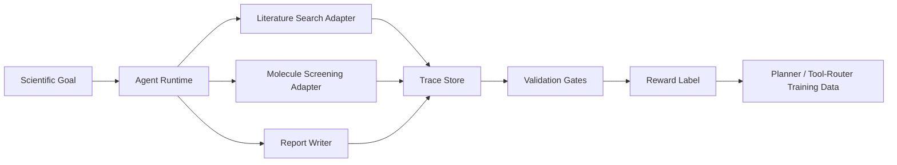

# SciTrace-RL

[](https://github.com/yinli-systems/scitrace-rl/actions/workflows/ci.yml)

## Positioning

SciTrace-RL is retained as the scientific-agent trace and reward-data prototype.
Its scope is auditable execution traces, validation gates, provenance bundles,
and training records for AI-for-science workflows.

It is not the general RAG or browser-search project. General retrieval and
citation UX belongs in
[SignalRAG](https://github.com/yinli-systems/signal-rag), and source-code
structure retrieval belongs in
[CodeGraph](https://github.com/yinli-systems/CodeGraph). New work here should
keep the scientific-agent trace/reward boundary explicit.

SciTrace-RL is a submission-ready demo for **AI4S Infra + scientific agents**. It turns a scientific-agent run into a reproducible execution trace, validates the trace, and converts the run into a reward-labeled training sample.

The project is designed for DP Technology's "追光计划" direction:

- Primary direction: **AI4S Infra**
- Secondary fit: **智能体赋能科学发现**
- Core idea: scientific agents should not only answer; they should leave auditable, replayable, and trainable execution evidence.

## What This Demo Shows

The demo runs a lightweight dry-lab workflow for lithium-ion battery electrolyte additive screening:

1. Retrieve evidence from a local scientific corpus.
2. Screen candidate additives with deterministic chemistry proxy features.
3. Generate a citation-grounded report.
4. Validate citations, replayability, constraints, and claim-evidence alignment.
5. Optionally run an AI judge over report claims and retrieved evidence.
6. Export a trace-to-reward sample for future planner/tool-router training.
7. Export a post-training bundle with SFT, DPO, process-reward, credit-assignment, and tool-router records.
8. Export an escalation packet for high-fidelity computation, wet-lab validation, expert review, and feedback ingestion.
9. Export an interoperability bundle aligned with W3C PROV, Workflow Run RO-Crate, and OpenTelemetry-style agent spans.
10. Run a 15-case eval suite with deterministic gates, optional DeepSeek/OpenAI-compatible judging, and explicit expert-review boundaries.
11. Run deep evaluation for trajectory quality, citation support precision, multi-run stability, cost/latency, and external-result ingestion.

This is intentionally not presented as a high-fidelity chemistry model. The value is the **infrastructure pattern**: trace schema, tool adapter boundaries, validation gates, artifact replay, and reward generation.

## Why It Fits DP Technology

DP Technology's Bohrium + SciMaster stack frames the bottleneck of agentic science as an infrastructure problem: workflows must become executable, observable, reproducible, governed, and continuously improvable. SciTrace-RL directly targets that bottleneck.

The demo mirrors the same platform logic:

- **Reading**: evidence retrieval from scientific sources.
- **Computing**: candidate scoring through a callable tool.
- **Validation**: trace-backed checks before promoting a result.
- **Feedback**: execution trace converted into reward data.

## Architecture



## Repository Structure

```text
.
├── data/
│   ├── corpus/scientific_sources.json
│   └── tasks/electrolyte_additive_screen.json
├── docs/
│   ├── ai_api_validation.md
│   ├── architecture.md
│   ├── demo_guide.md
│   ├── project_proposal_scitrace_rl.pdf
│   ├── project_proposal_scitrace_rl.tex
│   └── research_basis.md
├── outputs/
│   ├── demo_dashboard.html
│   ├── demo_report.md
│   ├── demo_trace.json
│   ├── escalation_packet.json
│   ├── post_training_bundle.json
│   ├── provenance_bundle.json
│   ├── eval/eval_report.md
│   ├── deep_eval/deep_eval_report.md
│   ├── eval_deepseek_v7/eval_report.md
│   ├── ranked_candidates.json
│   ├── retrieved_sources.json
│   ├── trace_to_reward_sample.json
│   └── validation_scorecard.json
├── src/scitrace_rl/
│   ├── ai_judge.py
│   ├── chemistry.py
│   ├── cli.py
│   ├── dashboard.py
│   ├── deep_eval.py
│   ├── escalation.py
│   ├── eval_suite.py
│   ├── external_feedback.py
│   ├── learning_signal.py
│   ├── runner.py
│   ├── schema.py
│   ├── tools.py
│   ├── utils.py
│   └── validators.py
└── tests/test_runner.py
```

## Quickstart

No external Python dependency is required.

```bash
python3 -m venv .venv
source .venv/bin/activate
python -m pip install -e .

scitrace-rl --out /tmp/scitrace-output
scitrace-rl-verify /tmp/scitrace-output
```

Expected output:

```text
trace_id=trace_...
reward=0.97
dashboard=/tmp/scitrace-output/demo_dashboard.html
verified 10 artifacts for trace trace_...
```

Open the dashboard:

```bash
open /tmp/scitrace-output/demo_dashboard.html
```

Run tests:

```bash
python -m unittest discover -s tests -v
```

Run the eval suite:

```bash
PYTHONPATH=src python3 -m scitrace_rl.eval_suite --out outputs/eval
```

Run the deep eval suite:

```bash
PYTHONPATH=src python3 -m scitrace_rl.deep_eval --out outputs/deep_eval --stability-runs 5
```

Optional DeepSeek AI judge:

```bash
export SCITRACE_AI_JUDGE=1
export DEEPSEEK_API_KEY="your_api_key"
export DEEPSEEK_MODEL="deepseek-v4-flash"
export DEEPSEEK_BASE_URL="https://api.deepseek.com"
PYTHONPATH=src python3 -m scitrace_rl.cli --out outputs
```

Run DeepSeek-backed evaluation:

```bash
PYTHONPATH=src python3 -m scitrace_rl.eval_suite --out outputs/eval_deepseek
```

## Benchmark-Aligned Evaluation

Recent science-agent and research-agent benchmarks suggest that a credible demo should test more than final-answer quality. SciTrace-RL therefore maps the public benchmark landscape into local, reproducible checks:

| Benchmark | What it stresses | SciTrace-RL coverage |
|---|---|---|
| [CORE-Bench](https://arxiv.org/abs/2409.11363) | Computational reproducibility across paper-based tasks | `artifact_replay`, deterministic screening hashes, `deep_eval` stability runs |
| [PaperBench](https://arxiv.org/abs/2504.01848) | Paper-to-code replication, experiment execution, rubric grading | trace artifacts, replay gates, report artifacts, structured validation scorecard |
| [MLR-Bench](https://arxiv.org/abs/2505.19955) | Open-ended ML research agents and fabricated experiment risk | adversarial cases for invented computation, unsupported quantitative claims, and premature deployment |
| [DeepResearch Bench](https://arxiv.org/abs/2506.11763) | Research-report quality, effective citations, citation accuracy | `citation_integrity`, `citation_support_precision`, claim metadata checks |
| [TRAJECT-Bench](https://arxiv.org/abs/2510.04550) | Tool selection, argument correctness, dependency/order satisfaction | `trajectory_quality` validates tool order, output contracts, artifact links, and duration sanity |
| [AIRS-Bench](https://arxiv.org/abs/2602.06855) | Full research lifecycle: ideas, experiments, analysis, iteration | `post_training_bundle`, `escalation_packet`, external feedback ingestion |
| [SPOT](https://arxiv.org/abs/2505.11855) | Verification of scientific errors in manuscripts | negative cases for wrong mechanism, unsupported transfer, overconfident safety, and citation mismatch |
| [FIRE-Bench](https://arxiv.org/abs/2602.02905) | Full-cycle scientific insight rediscovery | current coverage is partial: trace/reward/escalation infrastructure; real rediscovery tasks are future work |
| [MMDeepResearch-Bench](https://arxiv.org/abs/2601.12346) | Multimodal evidence grounding and citation integrity | current text-only trace design can ingest Uni-Parser/OmniScience artifacts, but multimodal support is future work |

Current comprehensive local run:

```text
unit tests: 4/4 passed
demo reward: 0.97
validation gates: 8
trajectory_quality: pass
citation_support_precision: pass
15-case adversarial eval: pass
deterministic_detection_rate: 1.0
citation_support_detection_rate: 1.0
semantic_or_support_detection_rate: 1.0
supported_case_pass_rate: 1.0
auto_resolvable_coverage: 0.8
expert_required_case_share: 0.2
deep_eval overall_status: pass
multi-run stability: 5 runs, 0 drift
external-result ingestion: pass
```

## Key Artifacts

- `docs/project_proposal_scitrace_rl.pdf`: concise proposal PDF.
- `docs/project_proposal_scitrace_rl.tex`: LaTeX source for the proposal.
- `docs/ai_api_validation.md`: optional AI API judge setup and rationale.
- `docs/demo_guide.md`: what the reviewer should inspect in the demo.
- `docs/research_basis.md`: source-backed rationale for the direction.
- `outputs/demo_trace.json`: full trace with tool calls, artifacts, validation results, and reward.
- `outputs/artifact_manifest.json`: byte sizes and SHA-256 content digests for every primary output in one run.
- `outputs/provenance_bundle.json`: W3C PROV, Workflow Run RO-Crate, and OpenTelemetry span views of the same run.
- `outputs/demo_report.md`: generated scientific-agent report.
- `outputs/validation_scorecard.json`: machine-readable validation gates.
- `outputs/trace_to_reward_sample.json`: one reward-labeled sample for future agent training.
- `outputs/post_training_bundle.json`: concrete SFT, DPO, process-reward, credit-assignment, and tool-router examples.
- `outputs/escalation_packet.json`: structured next-step handoff to computation, lab, expert review, and feedback ingestion.
- `outputs/eval/eval_report.md`: offline 15-case validation report.
- `outputs/deep_eval/deep_eval_report.md`: trajectory, citation-support, multi-run stability, and external-ingestion evaluation.
- `outputs/eval_deepseek_v7/eval_report.md`: DeepSeek-backed 15-case validation report from the latest real API run.

By default the `ai_claim_review` gate is marked `skip`, so the demo remains reproducible without external API access. When enabled, the AI judge reviews whether generated claims are supported by retrieved evidence.

## Evidence Boundaries

- The default workflow is a deterministic dry-lab demonstration over a small
  checked-in corpus and proxy chemistry features. It is not a validated
  molecular model, simulation result, or wet-lab finding.
- A passing reward and validation score mean the local trace satisfies this
  repository's gates; they do not prove scientific correctness outside those
  gates.
- `artifact_manifest.json` hashes the bytes actually written for a run. The
  `sha256` field on an in-trace artifact is a stable descriptor hash of its
  kind, URI, summary, and metadata, not a substitute for the file-content
  manifest.
- AI-judge results require an external endpoint and are reported separately;
  the offline default records that gate as `skip`.

## Improvement Priorities

1. Bind retrieved source snapshots and external compute results to immutable
   content-addressed inputs before promoting a trace beyond demo status.
2. Replace proxy screening with a versioned simulator or laboratory adapter and
   preserve its environment, logs, and raw outputs in the manifest.
3. Add schema migration tests for training and provenance exports before using
   bundles across releases.
4. Evaluate on independently authored tasks and expert rubrics; the current
   15-case suite mainly validates the local gate implementation.

## Extension Plan

The current adapters are intentionally local and deterministic. In a production Bohrium/SciMaster setting, the same interfaces can be replaced by:

- OpenAlex / PubMed / Uni-Parser / OmniScience evidence ingestion.
- Bohrium / Lebesgue compute jobs.
- Uni-Mol / DPA / Uni-Fold model calls.
- Uni-Lab-OS wet-lab execution hooks.
- Human/expert review queues for claim promotion and unresolved scientific boundary conditions.
- W3C PROV / Workflow Run RO-Crate export for FAIR scientific workflow records.
- OpenTelemetry GenAI spans for production observability.
- Offline RL, process-reward modeling, preference data, and tool-router training over validated traces.
