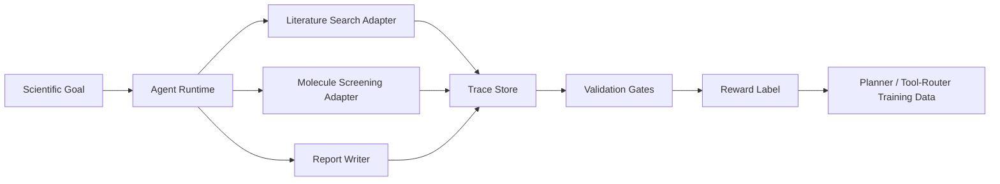

# SciTrace-RL

SciTrace-RL is a submission-ready demo for **AI4S Infra + scientific agents**. It turns a scientific-agent run into a reproducible execution trace, validates the trace, and converts the run into a reward-labeled training sample.

The project is designed for DP Technology's "追光计划" direction:

- Primary direction: **AI4S Infra**
- Secondary fit: **智能体赋能科学发现**
- Core idea: scientific agents should not only answer; they should leave auditable, replayable, and trainable execution evidence.

## What This Demo Shows

The demo runs a lightweight dry-lab workflow for lithium-ion battery electrolyte additive screening:

1. Retrieve evidence from a local scientific corpus.
2. Screen candidate additives with deterministic chemistry proxy features.
3. Generate a citation-grounded report.
4. Validate citations, replayability, constraints, and claim-evidence alignment.
5. Optionally run an AI judge over report claims and retrieved evidence.
6. Export a trace-to-reward sample for future planner/tool-router training.
7. Export a post-training bundle with SFT, DPO, process-reward, credit-assignment, and tool-router records.
8. Export an interoperability bundle aligned with W3C PROV, Workflow Run RO-Crate, and OpenTelemetry-style agent spans.
9. Run a 15-case eval suite with deterministic gates, optional DeepSeek/OpenAI-compatible judging, and explicit expert-review boundaries.

This is intentionally not presented as a high-fidelity chemistry model. The value is the **infrastructure pattern**: trace schema, tool adapter boundaries, validation gates, artifact replay, and reward generation.

## Why It Fits DP Technology

DP Technology's Bohrium + SciMaster stack frames the bottleneck of agentic science as an infrastructure problem: workflows must become executable, observable, reproducible, governed, and continuously improvable. SciTrace-RL directly targets that bottleneck.

The demo mirrors the same platform logic:

- **Reading**: evidence retrieval from scientific sources.
- **Computing**: candidate scoring through a callable tool.
- **Validation**: trace-backed checks before promoting a result.
- **Feedback**: execution trace converted into reward data.

## Architecture



## Repository Structure

```text
.
├── data/
│   ├── corpus/scientific_sources.json
│   └── tasks/electrolyte_additive_screen.json
├── docs/
│   ├── ai_api_validation.md
│   ├── architecture.md
│   ├── demo_guide.md
│   ├── project_proposal_scitrace_rl.pdf
│   ├── project_proposal_scitrace_rl.tex
│   └── research_basis.md
├── outputs/
│   ├── demo_dashboard.html
│   ├── demo_report.md
│   ├── demo_trace.json
│   ├── post_training_bundle.json
│   ├── provenance_bundle.json
│   ├── eval/eval_report.md
│   ├── eval_deepseek_v7/eval_report.md
│   ├── ranked_candidates.json
│   ├── retrieved_sources.json
│   ├── trace_to_reward_sample.json
│   └── validation_scorecard.json
├── src/scitrace_rl/
│   ├── ai_judge.py
│   ├── chemistry.py
│   ├── cli.py
│   ├── dashboard.py
│   ├── eval_suite.py
│   ├── learning_signal.py
│   ├── runner.py
│   ├── schema.py
│   ├── tools.py
│   ├── utils.py
│   └── validators.py
└── tests/test_runner.py
```

## Run

No external Python dependency is required.

```bash
PYTHONPATH=src python3 -m scitrace_rl.cli --out outputs
```

Expected output:

```text
trace_id=trace_...
reward=0.97
dashboard=outputs/demo_dashboard.html
```

Open the dashboard:

```bash
open outputs/demo_dashboard.html
```

Run tests:

```bash
PYTHONPATH=src python3 -m unittest discover -s tests
```

Run the eval suite:

```bash
PYTHONPATH=src python3 -m scitrace_rl.eval_suite --out outputs/eval
```

Optional DeepSeek AI judge:

```bash
export SCITRACE_AI_JUDGE=1
export DEEPSEEK_API_KEY="your_api_key"
export DEEPSEEK_MODEL="deepseek-v4-flash"
export DEEPSEEK_BASE_URL="https://api.deepseek.com"
PYTHONPATH=src python3 -m scitrace_rl.cli --out outputs
```

Run DeepSeek-backed evaluation:

```bash
PYTHONPATH=src python3 -m scitrace_rl.eval_suite --out outputs/eval_deepseek
```

## Key Artifacts

- `docs/project_proposal_scitrace_rl.pdf`: concise proposal PDF.
- `docs/project_proposal_scitrace_rl.tex`: LaTeX source for the proposal.
- `docs/ai_api_validation.md`: optional AI API judge setup and rationale.
- `docs/demo_guide.md`: what the reviewer should inspect in the demo.
- `docs/research_basis.md`: source-backed rationale for the direction.
- `outputs/demo_trace.json`: full trace with tool calls, artifacts, validation results, and reward.
- `outputs/provenance_bundle.json`: W3C PROV, Workflow Run RO-Crate, and OpenTelemetry span views of the same run.
- `outputs/demo_report.md`: generated scientific-agent report.
- `outputs/validation_scorecard.json`: machine-readable validation gates.
- `outputs/trace_to_reward_sample.json`: one reward-labeled sample for future agent training.
- `outputs/post_training_bundle.json`: concrete SFT, DPO, process-reward, credit-assignment, and tool-router examples.
- `outputs/eval/eval_report.md`: offline 15-case validation report.
- `outputs/eval_deepseek_v7/eval_report.md`: DeepSeek-backed 15-case validation report from the latest real API run.

By default the `ai_claim_review` gate is marked `skip`, so the demo remains reproducible without external API access. When enabled, the AI judge reviews whether generated claims are supported by retrieved evidence.

## Extension Plan

The current adapters are intentionally local and deterministic. In a production Bohrium/SciMaster setting, the same interfaces can be replaced by:

- OpenAlex / PubMed / Uni-Parser / OmniScience evidence ingestion.
- Bohrium / Lebesgue compute jobs.
- Uni-Mol / DPA / Uni-Fold model calls.
- Uni-Lab-OS wet-lab execution hooks.
- W3C PROV / Workflow Run RO-Crate export for FAIR scientific workflow records.
- OpenTelemetry GenAI spans for production observability.
- Offline RL, process-reward modeling, preference data, and tool-router training over validated traces.
