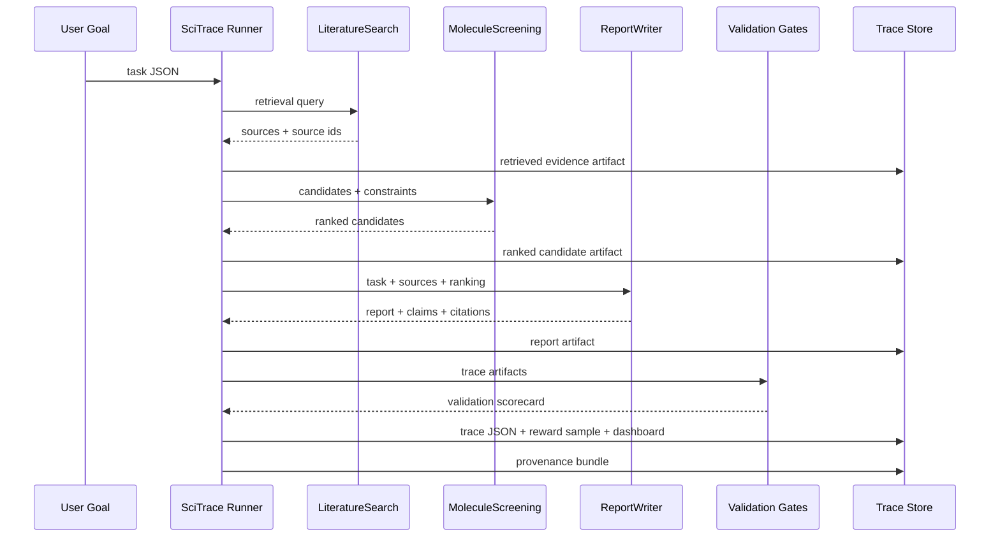

# SciTrace-RL Architecture

## Design Principle

Scientific agents need infrastructure that makes every step inspectable:

- What was the goal?
- Which tools were called?
- What exact inputs and outputs were used?
- Which artifacts were produced?
- Can the result be replayed?
- Which claims are supported by evidence?
- Can the execution be converted into training signal?

SciTrace-RL treats a scientific-agent run as a first-class data object, not as an opaque chat transcript.

## Core Objects

### Trace

The top-level record for one scientific workflow. It stores:

- `task_id`
- `goal`
- `domain`
- `tools`
- `artifacts`
- `validations`
- `metrics`
- `reward`

### ToolCall

A normalized record of one tool invocation:

- tool name
- structured inputs
- structured outputs
- status
- timestamps
- output hash
- linked artifacts

This makes scientific tools agent-ready: each call has a stable contract and can be audited.

### Artifact

A produced object such as retrieved sources, ranked candidates, report markdown, trace JSON, or reward data. Each artifact receives a hash to support reproducibility and tamper checks.

### ValidationResult

A machine-readable gate that decides whether a workflow is trustworthy enough to promote:

- `citation_integrity`
- `artifact_replay`
- `constraint_satisfaction`
- `claim_evidence_alignment`
- `ai_claim_review` when an API judge is enabled

### Reward

A scalar and explanation generated from validation quality and execution cost. This is the bridge from infrastructure to learning: successful and failed traces can become training data for planners, tool routers, and future scientific agents.

### Provenance Bundle

An interoperability export generated from the same trace. It has three views:

- `ro_crate`: a Workflow Run RO-Crate-style graph for FAIR scientific workflow packaging.
- `prov`: a W3C PROV-style graph of entities, activities, agents, usage, and generated artifacts.
- `otel`: an OpenTelemetry-style span tree for workflow, tool calls, and validation gates.

This keeps SciTrace-RL from becoming a private log format. The trace can be inspected locally, packaged as a scientific workflow record, and mapped into production observability systems.

## Runtime Flow

## Why This Is More Than Logging

Plain logs tell what happened. SciTrace-RL adds four things:

1. Structured contracts for tool calls.
2. Replayable artifacts with hashes.
3. Validation gates that produce machine-readable pass/fail scores, with optional AI semantic review.
4. Standards-aware provenance exports for FAIR workflow records and agent observability.
5. Reward labels that can train future orchestration policies.

This is the key difference between a demo agent and production AI4S infrastructure.

## Production Mapping

| Demo Component | Production Equivalent |
|---|---|
| Local corpus JSON | Bohrium Science Navigator, Uni-Parser, OmniScience, PubMed, OpenAlex |
| Molecule proxy screen | Bohrium/Lebesgue jobs, Uni-Mol, DPA, quantum chemistry, MD |
| Local report writer | SciMaster report agent |
| Validation gates | platform-level governance and scientific evaluation |
| JSON trace store | shared trace/event store |
| Provenance bundle | W3C PROV, Workflow Run RO-Crate, OpenTelemetry traces |
| Reward sample | offline RL, preference data, planner evaluation |
